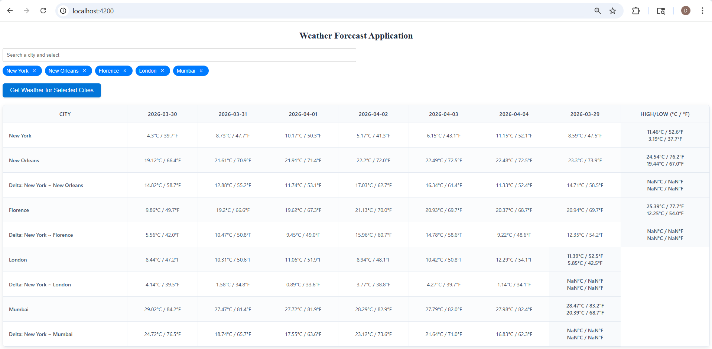

# WeatherUi

This project was generated using [Angular CLI](https://github.com/angular/angular-cli) version 19.0.2.

STEPS TO RUN THE APPLICATION:

1. **Install Dependencies**: Navigate to the project directory and run `npm install` to install all necessary dependencies.
2. **Start the Development Server**: Run `ng serve` to start the Angular development server.

